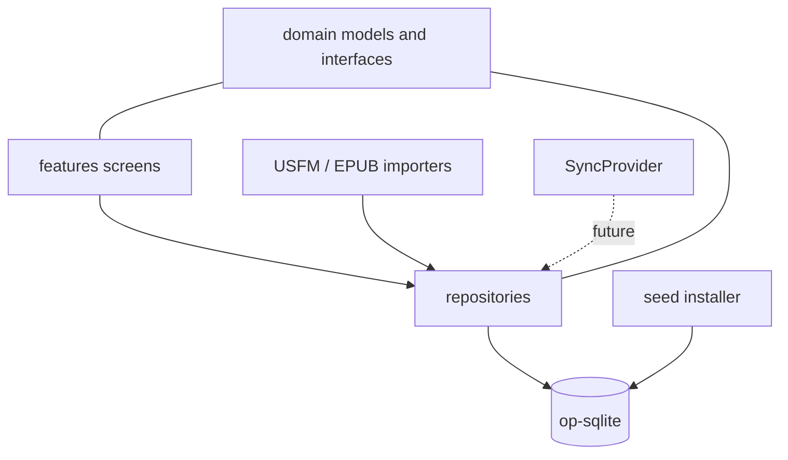

# Bible App

A cross-platform Bible reading app focused on side-by-side version comparison, notes, highlights, and search. Built on React Native so a single codebase drives macOS today and iOS next. No browser / webview involved.

## What you get out of the box

- **Three bundled public-domain translations**: King James Version (KJV), American Standard Version (ASV), Bible in Basic English (BBE).
- **Reader** with a parallel-compare mode (1..N versions side by side).
- **Library** listing installed versions with a hook to import more.
- **Notes** attached to a verse or verse range.
- **Highlights** in six colors.
- **Search** backed by SQLite FTS5.
- **Settings** with light/dark/system theme and a pluggable sync-provider selector.
- **Local-first storage** (op-sqlite) with `dirty` + `remote_id` columns on every user-data table so a future cloud sync is a drop-in `SyncProvider` implementation.

Mermaid view of the layers:



## Getting started on a Mac

Prereqs: macOS 12+, Xcode 16+, Node 20+, Ruby via `rbenv` with Bundler, CocoaPods.

```bash
git clone <repo-url>
cd bible-app
npm run install:all     # root + apps/mobile deps
npm run seed:build      # fetches KJV/ASV/BBE, writes apps/mobile/assets/bibles/seed.sqlite (~41 MB)
npm run macos:init      # one-time: adds the macOS Xcode target via react-native-macos
npm run pods            # installs CocoaPods for ios/ and macos/
```

After `macos:init` you must **add `apps/mobile/assets/bibles/seed.sqlite` to the Xcode project**:

1. `open apps/mobile/macos/BibleApp.xcworkspace` (name may vary).
2. In the left sidebar, drag `assets/bibles/seed.sqlite` into the project, selecting the macOS target and "Copy items if needed".
3. Confirm it appears under the target's "Build Phases -> Copy Bundle Resources".
4. Repeat for the iOS target when you're ready to run on iOS.

Then run:

```bash
npm start              # terminal 1: Metro bundler
npm run macos          # terminal 2: launches the macOS app
# or
npm run ios            # iOS simulator
```

If you hit build errors with `react-native-macos@0.81.x` (there's an open issue, see below), fall back to `0.79.x` by pinning both `react-native` and `react-native-macos` to `^0.79.4` in `apps/mobile/package.json` and rerunning the install.

## Headless smoke test

While Xcode isn't available (for example, from Linux CI), the full data path can be exercised against the seed with:

```bash
npm run smoke
```

This copies `seed.sqlite` into a working directory, runs migrations, lists the installed versions, reads Genesis 1 / John 3:16, creates a note + highlight, reopens the DB to confirm persistence, and does an FTS5 search. It is not a replacement for running on a real device but validates every layer below React Native.

## Repo layout

```
bible-app/
  apps/
    mobile/                         # the React Native app
      App.tsx                        # thin entry, delegates to src/app/AppRoot
      src/
        app/                         # AppRoot, providers, zustand stores
        navigation/                  # AppDrawer, param lists
        features/
          reader/                    # single + parallel-compare reader
          library/                   # version list + Import button
          notes/                     # list + editor
          highlights/                # palette + list
          search/                    # FTS5 search
          settings/                  # theme + sync provider
          _template/                 # copy this to start a new feature
        domain/                      # pure TS: Bible, Notes, Highlights, Sync
          bible/                     # Version, Book, Verse, Reference, Canon
          notes/
          highlights/
          sync/                      # SyncProvider contract
        data/
          db/                        # DbClient, opSqliteClient, migrations, schema
          repositories/              # BibleRepo, NotesRepo, HighlightsRepo
          importers/
            usfm/                    # parseUsfm + UsfmImporter
            epub/                    # EpubImporter (stub - typed TODO error)
          seed/                      # installSeed first-launch copy
          sync/                      # NoopSyncProvider + SyncProviderRegistry
        ui/                          # Screen, Text, Button, Row + theme tokens
        lib/                         # small helpers (reference parser, ...)
      assets/
        bibles/
          seed.sqlite                # built artifact (NOT committed)
      __tests__/                     # jest suites (node env, no RN preset)
  scripts/
    build-seed-db.ts                 # fetches + normalizes bundled Bibles
    smoke-test.ts                    # headless end-to-end sanity check
  packages/                          # reserved for future workspaces
  tsconfig.base.json                 # shared TS settings
  LLMs.md                            # pointer doc for AI contributors
```

## Scripts

| Command | What it does |
| --- | --- |
| `npm run install:all` | Install root + mobile deps |
| `npm start` | Metro bundler |
| `npm run macos` | Launch the macOS app |
| `npm run ios` | Launch the iOS simulator |
| `npm run android` | Launch on Android emulator (scaffolded, not targeted in this milestone) |
| `npm run pods` | `pod install` in both `ios/` and `macos/` |
| `npm run macos:init` | One-time: add the macOS Xcode project |
| `npm run seed:build` | Build the bundled Bible seed |
| `npm run seed:build -- --versions KJV,ASV` | Build a subset |
| `npm run smoke` | Headless end-to-end sanity check |
| `npm run typecheck` | `tsc --noEmit` on `apps/mobile` |
| `npm test` | Jest suite (node env) |

## Adding a new feature

1. `cp -r apps/mobile/src/features/_template apps/mobile/src/features/<name>`
2. Rename `PlaceholderScreen.tsx` and update `index.ts`.
3. Register it in [`apps/mobile/src/navigation/AppDrawer.tsx`](apps/mobile/src/navigation/AppDrawer.tsx).
4. Put any pure logic in `src/domain/<name>/` (no RN imports) so it can be unit-tested in Node and later extracted into a shared package.
5. Put any DB access behind a repository in `src/data/repositories/`. Do not touch `getDb()` directly from screens.

## Adding a cloud sync backend

Implement the [`SyncProvider`](apps/mobile/src/domain/sync/SyncProvider.ts) interface (Supabase, Firebase, self-hosted) and register the instance in [`SyncProviderRegistry`](apps/mobile/src/data/sync/SyncProviderRegistry.ts). All user-data tables (`notes`, `highlights`, `bookmarks`) already carry `dirty` + `remote_id` columns, so `pushDirty()` / `pullRemote()` have everything they need.

## Importing your own Bible

- **USFM** (single file per book): wire up a file picker in `LibraryScreen`, call `UsfmImporter.importFromFile()`, and commit the result via `BibleRepository.upsertVersion` + `insertBooks` + `bulkInsertVerses`. The parser handles `\id`, `\h`, `\c`, `\v`, and strips inline markers.
- **EPUB**: currently throws `EpubImportNotYetImplementedError`. Implementing it requires an unzip step and a XHTML-to-verse mapper; scoped for the next milestone.

## Known issues

- **`react-native-macos@0.81.x` build failures**: there's an open upstream issue ([#2936](https://github.com/microsoft/react-native-macos/issues/2936)) affecting some machines. If `npm run macos` fails with C++ / `fmt` errors, downgrade both `react-native` and `react-native-macos` to `^0.79.4`.
- **Seed not in bundle**: on first launch, if you see "No seed.sqlite in app bundle..." in the app, you forgot to add the file to the Xcode target's "Copy Bundle Resources" phase.
- **Text decoder in USFM importer**: `importFromBuffer` relies on a global `TextDecoder`. React Native 0.81 ships it; older versions may need a polyfill.

## License + attribution

- **App code**: (add a LICENSE file before release).
- **Bundled texts**: KJV and ASV are public domain; BBE entered the public domain upon UK copyright expiration. All three are sourced from [scrollmapper/bible_databases](https://github.com/scrollmapper/bible_databases) at build time.
